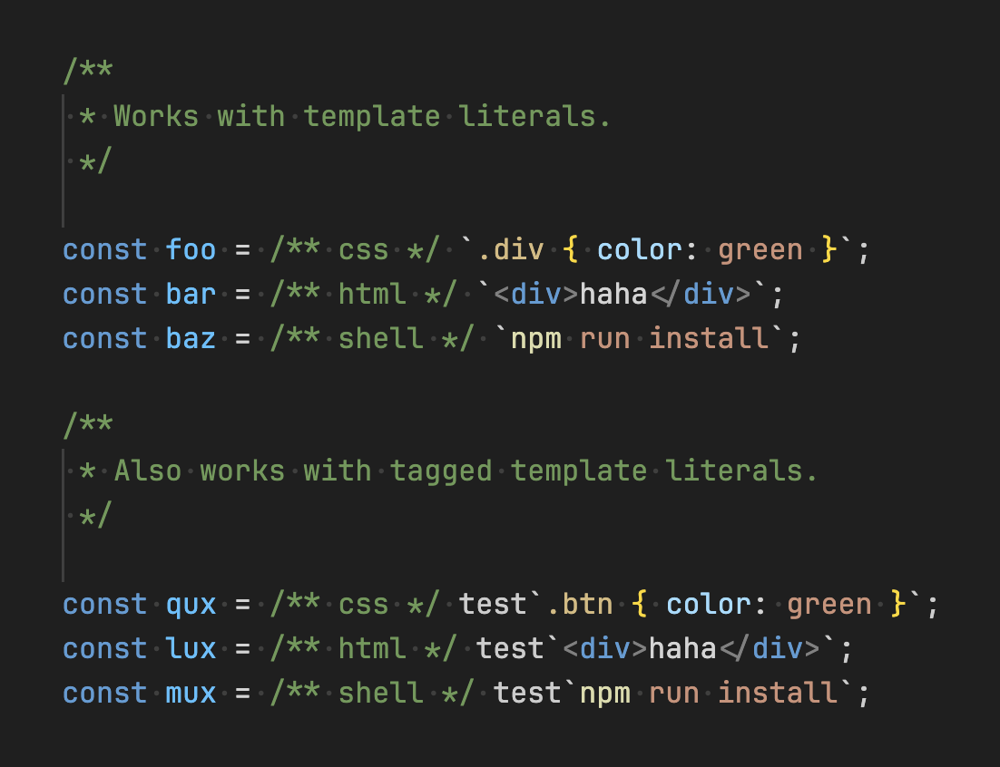

# vscode-syntax-highlight-comment

Syntax highlight template literals in JavaScript and TypeScript by placing a comment immediately before the backtick.

## Example

```ts
/**
 * Works with template literals.
 */

const foo = /** css */ `.div { color: green }`;
const bar = /** html */ `<div>haha</div>`;
const baz = /** shell */ `npm run install`;

/**
 * Also works with tagged template literals.
 */

const qux = /** css */ test`.btn { color: green }`;
const lux = /** html */ test`<div>haha</div>`;
const mux = /** shell */ test`npm run install`;
```

## Result



### Notes

- Marker comment must be directly before the template literal (or its tag expression), optionally with whitespace in between.
- Basic `${...}` interpolation is supported inside marked template literals.
