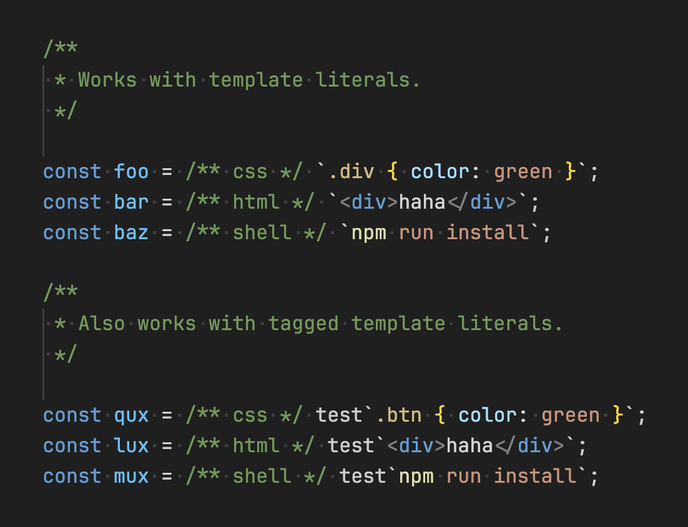

# vscode-syntax-highlight-comment

Syntax highlight template literals in JavaScript and TypeScript by placing a comment immediately before the backtick.

## Example

```ts
/**
 * Works with template literals.
 */

const foo = /** css */ `.div { color: green }`;
const bar = /** html */ `<div>haha</div>`;
const bop = /* js */ `const answer = 42;`;
const jop = /* jsx */ `const label = <span>Answer</span>;`;
const baz = /** shell */ `npm run install`;
const zap = /** ts */ `const answer: number = 42;`;
const zip = /** tsx */ `const label = <span>Answer</span>;`;

/**
 * Also works with tagged template literals.
 */

const qux = /** css */ test`.btn { color: green }`;
const lux = /** html */ test`<div>haha</div>`;
const wop = /* js */ test`const answer = 42;`;
const jup = /* jsx */ test`const label = <span>Answer</span>;`;
const mux = /** shell */ test`npm run install`;
const tap = /** ts */ test`const answer: number = 42;`;
const tip = /** tsx */ test`const label = <span>Answer</span>;`;
```

## Result



### Not supported: `editor.experimental.preferTreeSitter`

> [!WARNING]
> This extension does not work when tree-sitter tokenization is enabled for a
> language it targets — most notably
> `"editor.experimental.preferTreeSitter.typescript": true`.

- Highlighting here is delivered entirely by TextMate grammar injection.
- When `preferTreeSitter` is on for a language, VS Code hands that language's tokenization to tree-sitter and ignores injected TextMate grammars outright.
- The result is that marked template literals in `.ts`/`.tsx` files render as plain strings, with no error and no diagnostic.
- To confirm this is what you are hitting, run **Developer: Inspect Editor Tokens and Scopes** and look for `tree-sitter token` / `tree-sitter tree` rows in the inspector.
- The fix is to turn the setting off:
  - `"editor.experimental.preferTreeSitter.typescript": false`
- Other `preferTreeSitter` languages (`css`, `ini`, `regex`) are harmless — this extension does not inject into them.

### Notes

- Marker comment must be directly before the template literal (or its tag expression), optionally with whitespace in between.
- Basic `${...}` interpolation is supported inside marked template literals.
